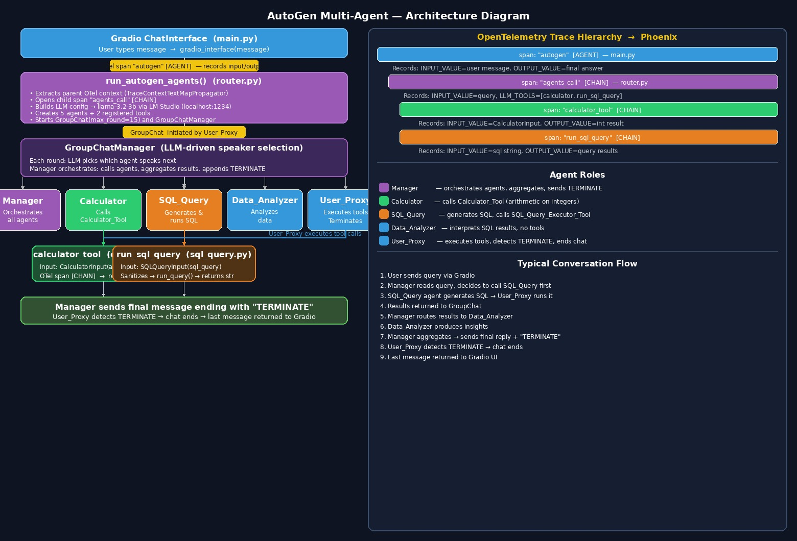

# AutoGen Multi-Agent Example — Detailed Explanation

## Overview

This example builds a **multi-agent chatbot** using Microsoft's AutoGen framework, with Phoenix (OpenTelemetry) tracing and a Gradio UI. It runs a local LLM via LM Studio.

---

## Architecture Diagram



```
User (Gradio UI)
     │
     ▼
main.py  ──── creates OTel root span ──▶ Phoenix tracing
     │
     ▼
router.py: run_autogen_agents()
     │
     ▼
GroupChat (AutoGen)
  ├── Manager Agent       ← orchestrates the conversation
  ├── Calculator Agent    ← calls Calculator_Tool
  ├── SQL_Query Agent     ← calls SQL_Query_Executor_Tool
  ├── Data_Analyzer Agent ← analyzes data, no tools
  └── User_Proxy Agent    ← executes tool calls, terminates on TERMINATE
```

---

## File-by-file

### `main.py`

**Entry point.** Does three things:

1. **Instruments Phoenix tracing** (`instrument(project_name="autogen-multi-agent", framework=Framework.AUTOGEN)`) — sets up OpenTelemetry to send traces to Phoenix.
2. **Wraps each chat turn in a root OTel span** (`"autogen"`) tagged as `AGENT` kind, recording input/output values.
3. **Injects trace context** (`TraceContextTextMapPropagator`) into a dict and passes it to `run_autogen_agents()` — this allows the child span in `router.py` to be linked to the parent span correctly across function boundaries.
4. **Launches a Gradio ChatInterface** — simple chat UI, calls `gradio_interface` on each message.

---

### `router.py` — `run_autogen_agents()`

**The core orchestration logic.** Key steps:

#### LLM Config

```python
config_list = [{"model": "llama-3.2-3b-instruct", "api_key": "lm-studio", "base_url": "http://localhost:1234/v1", ...}]
```

Uses a **local LM Studio** instance serving Llama 3.2 via OpenAI-compatible API.

#### Agents

| Agent | Type | Role |
|---|---|---|
| `Calculator` | `AssistantAgent` | Calls `Calculator_Tool` for arithmetic |
| `Data_Analyzer` | `AssistantAgent` | Analyzes/summarizes data, no tools |
| `SQL_Query` | `AssistantAgent` | Generates + runs SQL queries |
| `Manager` | `AssistantAgent` | Orchestrator — decides which agents to call and aggregates results |
| `User_Proxy` | `UserProxyAgent` | Executes tool calls; terminates when it sees `"TERMINATE"` in a message |

#### Tool Registration

```python
register_function(calculator, caller=calculator_agent, executor=user_proxy_agent, ...)
register_function(run_sql_query, caller=sql_query_agent, executor=user_proxy_agent, ...)
```

- The **caller** (AssistantAgent) decides *when* to invoke the tool.
- The **executor** (UserProxyAgent) actually *runs* the tool function.

This is AutoGen's separation of concerns: the LLM proposes the call, the proxy executes it.

#### GroupChat

```python
groupchat = GroupChat(agents=agents, messages=[], max_round=15)
groupchat_manager = GroupChatManager(groupchat=groupchat, llm_config=llm_config)
```

AutoGen's `GroupChat` routes messages between agents. The `GroupChatManager` uses the LLM to pick which agent speaks next. `max_round=15` caps the conversation length.

#### Termination

The `User_Proxy` checks every message for `"TERMINATE"` — the `Manager` is instructed to append it to its final message when done.

---

### `calculator.py`

A **tool** that performs `+`, `-`, `*`, `/` on two integers. Uses a Pydantic `CalculatorInput` model for typed input, and wraps execution in an OTel span for tracing.

---

### `sql_query.py`

A **tool** that accepts a SQL query string (as `SQLQueryInput`), sanitizes it (strips markdown code fences), runs it against the database via `run_query()`, and returns results as a string. Also traced with OTel.

---

## Tracing / Observability

Every layer creates its own OTel span:

```
autogen (AGENT span)               ← main.py
  └── agents_call (CHAIN span)     ← router.py
        ├── calculator_tool        ← calculator.py
        └── run_sql_query          ← sql_query.py
```

All spans are sent to Phoenix for visualization. The `TraceContextTextMapPropagator` propagates the trace ID across function calls so the hierarchy is maintained.

---

## Typical Flow

For a query like _"What are the sales trends?"_:

1. User types in Gradio → `gradio_interface` opens a root span.
2. `run_autogen_agents` starts a group chat.
3. `Manager` decides to use `SQL_Query` agent first.
4. `SQL_Query` agent generates a SQL query → `User_Proxy` executes `run_sql_query` tool.
5. Results are returned to the group chat.
6. `Manager` passes results to `Data_Analyzer`.
7. `Data_Analyzer` produces insights.
8. `Manager` aggregates everything into a final message ending with `"TERMINATE"`.
9. `User_Proxy` detects `"TERMINATE"` and stops the chat.
10. Last message is returned to Gradio and displayed.
