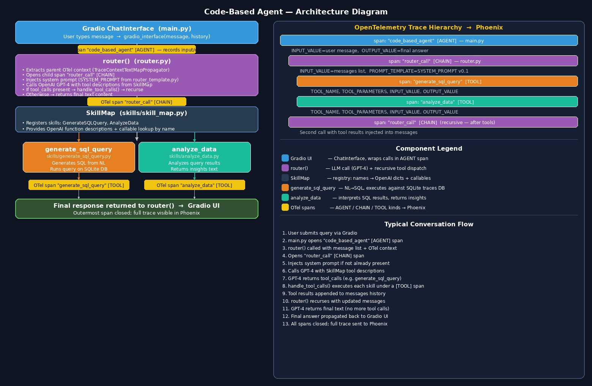

# Code-Based Agent — Explanation



## Overview

The code-based agent is a hand-rolled, framework-free implementation of a multi-step AI data analyst. Instead of relying on AutoGen, CrewAI, or LangGraph, it wires together an OpenAI LLM, a set of skills, and OpenTelemetry tracing using plain Python. The result is a Gradio chat interface where a user can ask natural-language questions about a SQLite database and receive data-driven answers.

---

## Components

| File | Role |
|------|------|
| `main.py` | Entry point — launches Gradio, opens the root OTel span |
| `router.py` | Core loop — calls GPT-4, dispatches tool calls, recurses |
| `skills/skill_map.py` | Registry that maps skill names → OpenAI dicts + callables |
| `skills/generate_sql_query.py` | Skill: NL → SQL → executes against SQLite |
| `skills/analyze_data.py` | Skill: interprets query results, returns text insights |
| `prompt_templates/router_template.py` | System prompt for the router LLM call |

---

## Entry Point — `main.py`

`gradio_interface` is the Gradio callback. It opens the top-level OpenTelemetry span (`code_based_agent`, kind `AGENT`), injects the trace context, calls `router()`, and records the final answer.

```python
def gradio_interface(message, history):
    tracer = trace.get_tracer(__name__)
    with tracer.start_as_current_span("code_based_agent") as span:
        span.set_attribute(SpanAttributes.INPUT_VALUE, message)
        span.set_attribute(SpanAttributes.OPENINFERENCE_SPAN_KIND, "AGENT")

        message = [{"role": "user", "content": message}]
        context = {}
        TraceContextTextMapPropagator().inject(context)
        agent_response = router(message, context)

        span.set_attribute(SpanAttributes.OUTPUT_VALUE, agent_response)
        span.set_status(trace.Status(trace.StatusCode.OK))
        return agent_response
```

---

## Router — `router.py`

The router is the brain of the agent. It:

1. Extracts the parent OTel context so the child span is correctly linked.
2. Opens a `router_call` span (kind `CHAIN`).
3. Injects the system prompt on the first call.
4. Calls GPT-4 with tool descriptions from `SkillMap`.
5. If GPT-4 returns `tool_calls`, dispatches them via `handle_tool_calls()` and **recurses**.
6. If GPT-4 returns plain text, returns it as the final answer.

```python
def router(messages, parent_context):
    tracer = trace.get_tracer(__name__)
    propagator = TraceContextTextMapPropagator()
    context = propagator.extract(parent_context)

    with tracer.start_as_current_span("router_call", context=context) as span:
        span.set_attribute(SpanAttributes.OPENINFERENCE_SPAN_KIND, "CHAIN")
        span.set_attribute(SpanAttributes.INPUT_VALUE, str(messages))

        # Inject system prompt on first call
        if not any(m.get("role") == "system" for m in messages if isinstance(m, dict)):
            messages.append({"role": "system", "content": SYSTEM_PROMPT})

        with using_prompt_template(template=SYSTEM_PROMPT, version="v0.1"):
            response = client.chat.completions.create(
                model="gpt-4",
                messages=messages,
                tools=skill_map.get_combined_function_description_for_openai(),
            )

        messages.append(response.choices[0].message)
        tool_calls = response.choices[0].message.tool_calls

        if tool_calls:
            handle_tool_calls(tool_calls, messages, tracer)
            new_context = {}
            propagator.inject(new_context)
            return router(messages, new_context)   # ← recursive
        else:
            return response.choices[0].message.content
```

Each tool call is executed inside its own `TOOL` span:

```python
def handle_tool_calls(tool_calls, messages, tracer):
    for tool_call in tool_calls:
        function_name = tool_call.function.name
        arguments = json.loads(tool_call.function.arguments)
        function_to_call = skill_map.get_function_callable_by_name(function_name)

        with tracer.start_as_current_span(function_name) as span:
            span.set_attribute(SpanAttributes.OPENINFERENCE_SPAN_KIND, "TOOL")
            span.set_attribute(SpanAttributes.TOOL_NAME, function_name)
            span.set_attribute(SpanAttributes.TOOL_PARAMETERS, str(arguments))
            span.set_attribute(SpanAttributes.INPUT_VALUE, str(arguments))
            function_result = function_to_call(arguments)
            span.set_attribute(SpanAttributes.OUTPUT_VALUE, function_result)

        messages.append({
            "role": "tool",
            "content": function_result,
            "tool_call_id": tool_call.id,
        })
```

---

## SkillMap — `skills/skill_map.py`

`SkillMap` decouples skill registration from the router. Adding a new skill only requires creating a class that inherits from `Skill` and appending it to the list in `__init__`.

```python
class SkillMap:
    def __init__(self):
        skills = [AnalyzeData(), GenerateSQLQuery()]
        self.skill_map = {}
        for skill in skills:
            self.skill_map[skill.get_function_name()] = (
                skill.get_function_dict(),
                skill.get_function_callable(),
            )

    def get_function_callable_by_name(self, skill_name) -> Callable:
        return self.skill_map[skill_name][1]

    def get_combined_function_description_for_openai(self):
        return [fd for fd, _ in self.skill_map.values()]
```

---

## Skill: `generate_sql_query`

Converts a natural-language prompt into SQL using GPT-4o, runs the query against the SQLite traces database, and returns the results as a string. Retries up to 2 times on failure.

```python
def generate_and_run_sql_query(self, args, with_retries=True):
    prompt = args["prompt"]
    client = OpenAI()

    with using_prompt_template(template=SYSTEM_PROMPT, variables={"SCHEMA": self.schema, "TABLE": self.table}, version="v0.1"):
        response = client.chat.completions.create(
            model="gpt-4o",
            messages=[
                {"role": "system", "content": SYSTEM_PROMPT.format(SCHEMA=self.schema, TABLE=self.table)},
                {"role": "user", "content": prompt},
            ],
        )

    sql_query = response.choices[0].message.content
    sanitized_query = self._sanitize_query(sql_query)

    with tracer.start_as_current_span("run_sql_query") as span:
        span.set_attribute(SpanAttributes.OPENINFERENCE_SPAN_KIND, "CHAIN")
        span.set_attribute(SpanAttributes.INPUT_VALUE, sql_query)
        results = str(run_query(sanitized_query))
        span.set_attribute(SpanAttributes.OUTPUT_VALUE, results)

    return results
```

---

## Skill: `analyze_data`

Takes the raw SQL results and the original user prompt, and asks GPT-4o to produce a human-readable analysis.

```python
def data_analyzer(self, args):
    prompt = args["prompt"]
    data = args["data"]
    client = OpenAI()

    with tracer.start_as_current_span("data_analysis_tool") as span:
        span.set_attribute(SpanAttributes.OPENINFERENCE_SPAN_KIND, "CHAIN")
        span.set_attribute(SpanAttributes.INPUT_VALUE, PROMPT_TEMPLATE.format(PROMPT=prompt, DATA=data))

        with using_prompt_template(template=PROMPT_TEMPLATE, variables={"PROMPT": prompt, "DATA": data}, version="v0.1"):
            response = client.chat.completions.create(
                model="gpt-4o",
                messages=[
                    {"role": "system", "content": SYSTEM_PROMPT},
                    {"role": "user", "content": PROMPT_TEMPLATE.format(PROMPT=prompt, DATA=data)},
                ],
            )

        analysis_result = response.choices[0].message.content
        span.set_attribute(SpanAttributes.OUTPUT_VALUE, analysis_result)
        return analysis_result
```

---

## Router System Prompt

The system prompt keeps the router focused: it must always call a tool or return text, never mix both, and must incorporate all tool results into the final reply.

```python
SYSTEM_PROMPT = """
You are a helpful assistant that choses a tool to call based on the user's request.

All of your responses should be a tool call or text. Only generate tool calls or text.
If you generate a tool call, be sure you include the original prompt as is in the parameters.

Once you receive the results from all of your skills, generate a response to the
user that incorporates all of the results.
"""
```

---

## OpenTelemetry Trace Hierarchy

```
span: "code_based_agent"  [AGENT]          ← main.py
  span: "router_call"     [CHAIN]          ← router.py (first call)
    span: "generate_and_run_sql_query" [TOOL]
      span: "run_sql_query"           [CHAIN]  ← inside the skill
    span: "data_analyzer"             [TOOL]
      span: "data_analysis_tool"      [CHAIN]  ← inside the skill
  span: "router_call"     [CHAIN]          ← router.py (recursive, final answer)
```

All spans are exported to **Phoenix** for trace inspection, latency analysis, and prompt debugging.

---

## Typical Conversation Flow

1. User submits a question via the Gradio chat interface.
2. `main.py` opens the root `code_based_agent` AGENT span and injects OTel context.
3. `router()` opens a `router_call` CHAIN span and calls GPT-4 with the SkillMap tool descriptions.
4. GPT-4 decides to call `generate_and_run_sql_query` — the router dispatches it under a TOOL span.
5. The skill generates SQL, executes it against the SQLite DB, and returns the rows.
6. The tool result is appended to the message history.
7. `router()` recurses; GPT-4 now calls `data_analyzer` with the SQL results.
8. `data_analyzer` asks GPT-4o to interpret the rows and returns a text summary.
9. `router()` recurses again; GPT-4 has all results and returns a final plain-text answer.
10. The answer propagates back to Gradio; all spans are closed and sent to Phoenix.
