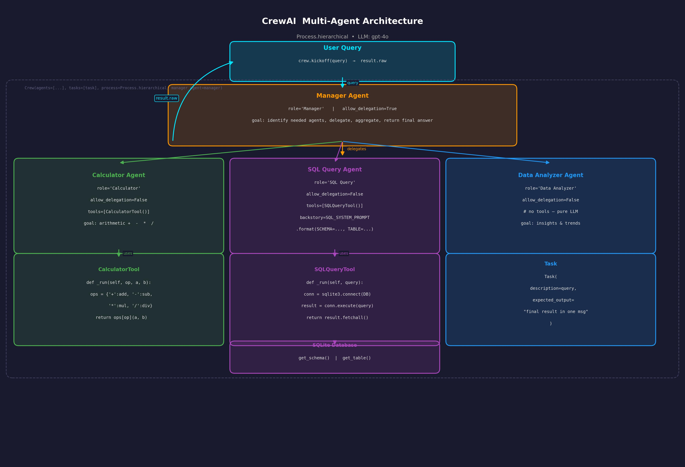

# CrewAI Multi-Agent Architecture

## Core Idea

**CrewAI** is a framework for building multi-agent AI systems where specialized agents work together like a crew/team to complete complex tasks. Each agent has a defined role, goal, and backstory (system prompt), and can be equipped with tools.

---

## Key Concepts

| Concept | Description |
|---|---|
| **Agent** | An LLM-powered worker with a `role`, `goal`, and `backstory`. The backstory shapes its behavior like a system prompt. |
| **Tool** | A callable function an agent can invoke (e.g. run SQL, do arithmetic). |
| **Task** | A unit of work — a description of what needs to be done and the expected output. |
| **Crew** | A group of agents assigned to tasks, with a defined `process` (how they coordinate). |

---

## Process: `hierarchical`

This example uses `Process.hierarchical` — a **Manager Agent** orchestrates the work by delegating subtasks to specialist agents, collecting their results, and returning a unified answer. This mirrors how a real team works.

---

## Agents

### Manager Agent
```python
manager_agent = Agent(
    role="Manager",
    goal="Identify and make all necessary agent calls, aggregate results, return final answer.",
    backstory=MANAGER_SYSTEM_PROMPT,
    allow_delegation=True,
    llm="gpt-4o",
)
```
- The only agent with `allow_delegation=True`
- Reads the user query, decides which specialist agents to call, and combines their outputs

---

### Calculator Agent
```python
calculator_agent = Agent(
    role="Calculator",
    goal="Perform basic arithmetic operations (+, -, *, /) on two integers.",
    backstory="You are a helpful assistant that can perform basic arithmetic operations.",
    tools=[CalculatorTool()],
    allow_delegation=False,
    llm="gpt-4o",
)
```
- Handles math queries using `CalculatorTool`

---

### SQL Query Agent
```python
sql_query_agent = Agent(
    role="SQL Query",
    goal="Generate a SQL query based on a user prompt and run it on the database.",
    backstory=SQL_SYSTEM_PROMPT.format(SCHEMA=get_schema(), TABLE=get_table()),
    tools=[SQLQueryTool()],
    allow_delegation=False,
    llm="gpt-4o",
)
```
- Backstory is seeded with the actual DB schema so the agent knows the table structure
- Uses `SQLQueryTool` to execute queries against the SQLite database

---

### Data Analyzer Agent
```python
data_analyzer_agent = Agent(
    role="Data Analyzer",
    goal="Provide insights, trends, or analysis based on the data and prompt.",
    backstory="You are a helpful assistant that can provide insights and trends.",
    allow_delegation=False,
    llm="gpt-4o",
)
```
- No tools — pure LLM reasoning
- Typically receives data fetched by the SQL Query Agent and interprets it

---

## Tools

### CalculatorTool
```python
def _run(self, op, a, b):
    ops = {'+': add, '-': sub, '*': mul, '/': div}
    return ops[op](a, b)
```

### SQLQueryTool
```python
def _run(self, query):
    conn = sqlite3.connect(DB)
    result = conn.execute(query)
    return result.fetchall()
```

---

## Task & Crew Setup

```python
user_query_task = Task(
    description=query,
    expected_output="Once all agent calls are completed and the final result is ready, return it in a single message.",
)

crew = Crew(
    agents=[calculator_agent, data_analyzer_agent, sql_query_agent],
    tasks=[user_query_task],
    process=Process.hierarchical,
    manager_agent=manager_agent,
)

result = crew.kickoff()
return result.raw
```

---

## Flow Summary

```
User Query
    │  crew.kickoff(query)
    ▼
Manager Agent  (allow_delegation=True)
    ├──► Calculator Agent  ──► CalculatorTool
    ├──► SQL Query Agent   ──► SQLQueryTool ──► SQLite DB
    └──► Data Analyzer Agent  (pure LLM)
    │
    ▼
result.raw  →  returned to caller
```

For a trend analysis query, the typical flow is:
1. Manager calls **SQL Query Agent** to fetch data from the database
2. Manager passes that data to **Data Analyzer Agent** for interpretation
3. Manager aggregates and returns the final answer

---

## Diagram


