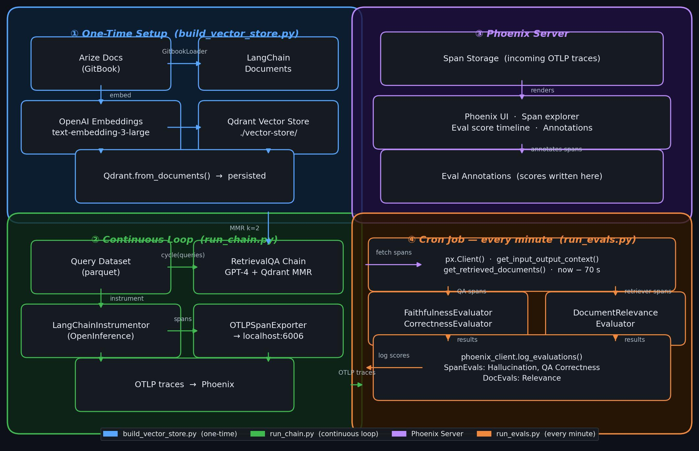
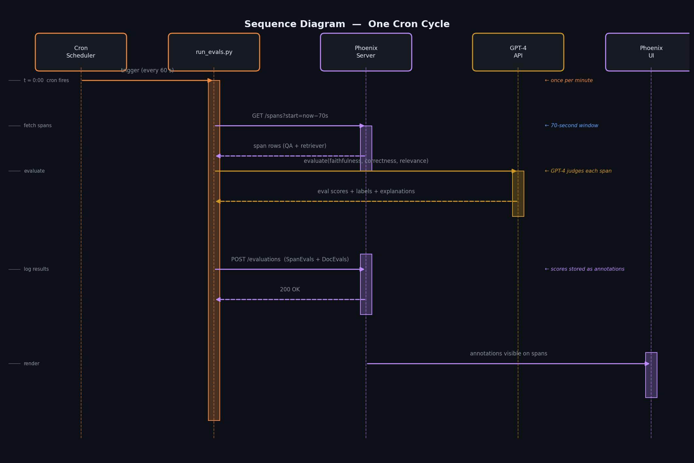
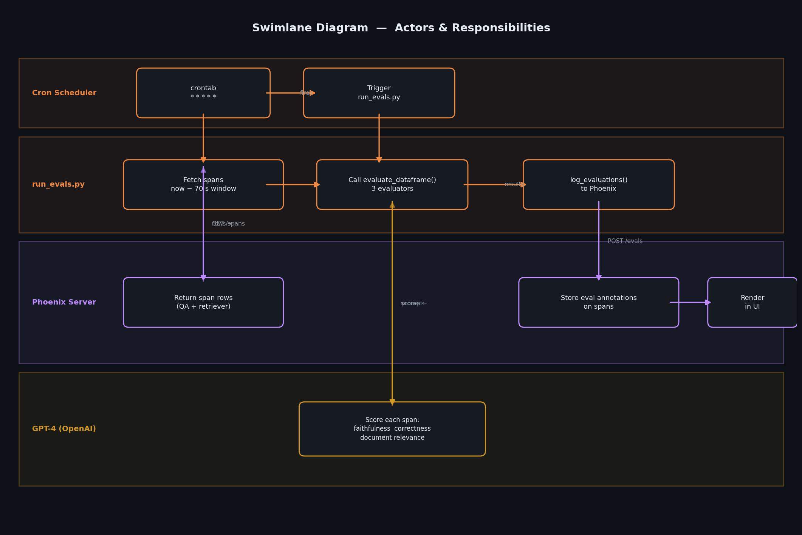
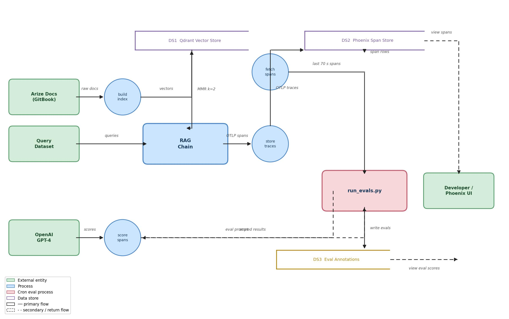

# Running Evals with Cron

This example demonstrates how to compute and upload evals on a regular schedule using `cron`.

## Architecture

### System Overview

Shows all components and how they connect at a glance.



### Component Breakdown

| Script | When | What it does |
|---|---|---|
| `build_vector_store.py` | Once | Crawls Arize docs via GitBook, embeds with `text-embedding-3-large`, persists Qdrant index to `./vector-store/` |
| `run_chain.py` | Continuous | Runs a LangChain `RetrievalQA` loop over pre-loaded queries, emitting OpenTelemetry traces to Phoenix |
| `run_evals.py` | Every minute (cron) | Fetches the last ~70s of spans from Phoenix, scores them with GPT-4, and logs eval results back as span annotations |

**Evaluation metrics computed each minute:**
- **Faithfulness** — detects hallucinations (did the answer stay grounded in retrieved docs?)
- **QA Correctness** — measures factual accuracy of the answer
- **Document Relevance** — scores whether retrieved chunks were relevant to the query

> The eval script is stateless: it always queries a fixed time window relative to `now`, so it is safe to restart or reschedule. If you change the cron frequency, update the `timedelta` in `run_evals.py` to match.

---

### Sequence Diagram — One Cron Cycle

Shows the exact order of API calls and data exchanged during a single minute-by-minute eval run.



---

### Swimlane Diagram — Actors & Responsibilities

Shows which component owns each step, and where responsibility crosses service boundaries.



---

### Data Flow Diagram — What Data Moves Where

Shows every data store, process, and external entity, and the data that flows between them — independent of timing or code structure.



## Setup

Install project dependencies using

```
pip install -r requirements.txt
```

Build and persist a LangChain Qdrant vector store over the Arize documentation by running

```
python build_vector_store.py
```

This script will persist your vector store to the `vector-store` directory.

Run Phoenix with

```
python -m phoenix.server.main serve
```

In a new terminal, define, instrument, and run a LangChain `RetrievalQA` chain to answer queries over your newly created vector store.

```
python run_chain.py
```

This script will loop indefinitely while emitting traces to your running instance of Phoenix. At this point, you should confirm that traces are appearing in the Phoenix app.

From a new terminal, add the following line to your crontab using `crontab -e` and replacing the API key and paths as appropriate.

```
* * * * * OPENAI_API_KEY=sk-your-openai-api-key /path/to/python /path/to/phoenix/examples/cron-evals/run_evals.py > /path/to/evals.log 2>&1
```

Once per minute, the script will query relevant spans from the past minute and compute and log evaluations to Phoenix. You should verify that evaluations appear as annotations on your spans in the Phoenix app at one-minute intervals.

ℹ️ If you are using a virtual environment, you can find the path to your Python interpreter by running `which python` while the environment is activated.

ℹ️ View logs of your evaluation runs with `tail -f /path/to/evals.log`.

ℹ️ If you don't wish to store your OpenAI API key directly in the crontab, there are [alternative ways](https://stackoverflow.com/questions/2229825/where-can-i-set-environment-variables-that-crontab-will-use) of making it available to the cron job depending on your OS.

ℹ️ The `run_evals.py` script is hard-coded to select relevant spans within the past one-minute time range. If you wish to run your evaluations at a different frequency, adjust both the time-window in the script and the cron schedule accordingly.

ℹ️ The evaluations in `run_evals.py` are appropriate for the chain defined in `run_chain.py`. If you wish to run scheduled evals with your own LLM application, ensure that the evals inside of `run_evals.py` are appropriate for your application.
